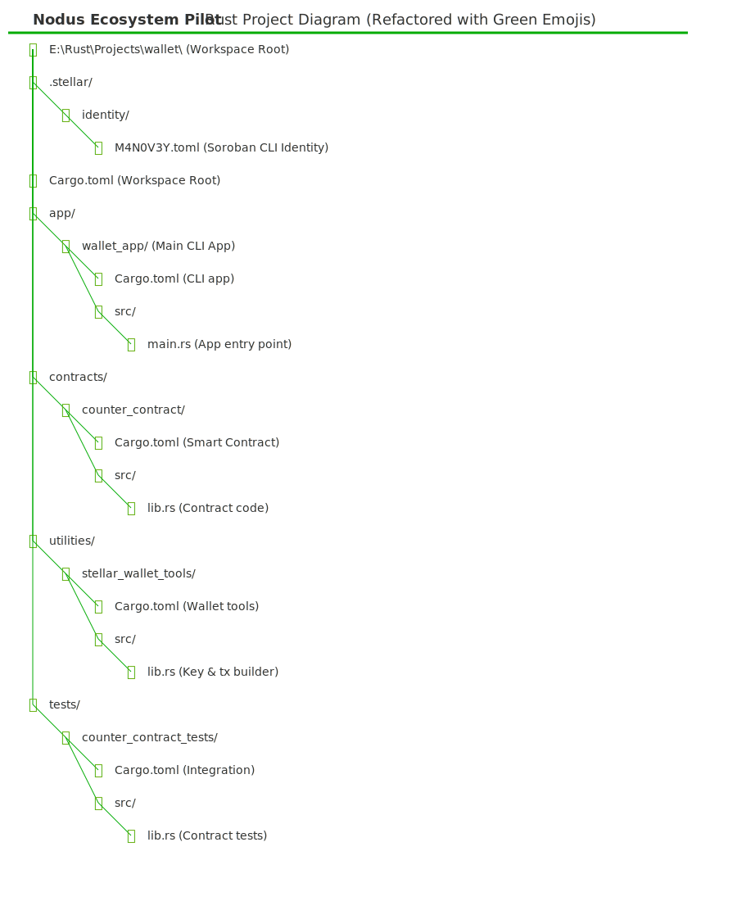

# ? Rust Stellar Wallet

A modular wallet app built in Rust for interacting with the Stellar blockchain, including smart contracts via Soroban.
This code is part of the study effort of the Nodus team for HackMeridien 2K25

## ?  Features

- Generate keypairs
- Build and send transactions
- Compile Soroban smart contracts
- CLI for quick commands

## ?  Source code filesystem:


 


## ?  Project structure

###  ?  Stellar wallet - Core
#### ?  stellar-wallet-core/
#### ?     src/
#### ?        .. lib.rs
#### ?        .. keys.rs
#### ?        .. tx.rs
#### ?        .. utils.rs
#### ?     Cargo.toml

###  ?  Stellar wallet – Cli
###  ?  stellar-wallet-cli/
#### ?     src/
#### ?        .. main.rs
#### ?        .. commands.rs
#### ?     Cargo.toml

## ?  Setup

#### ?  … work in progress

## ?  Build and generate
```bash
cargo build
cargo run -p stellar-wallet-cli generate

